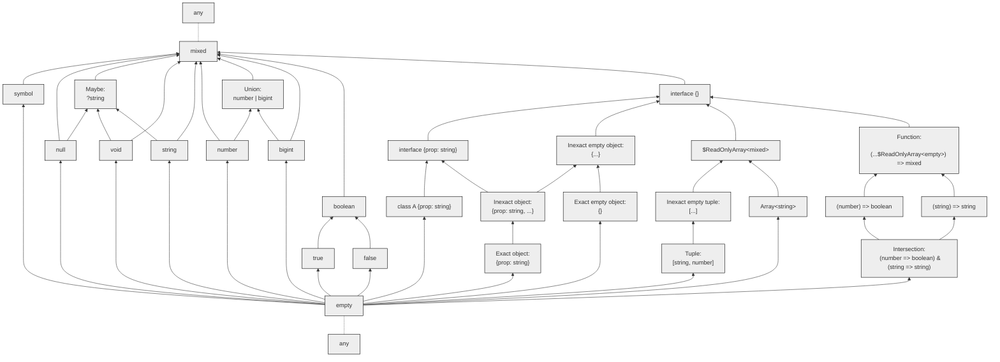

Types in Flow form a hierarchy based on [subtyping](../subtypes):

Click on a node to go to the documentation for that type.

Types appearing higher in this graph are more general, while those appearing lower are more specific.
An arrow pointing from type `A` to type `B` means that `A` is a subtype of `B`.
For example, the type `string` is a subtype of `?string`.

How can `any` be at both the top and the bottom? Because [it is unsafe](../../types/any/). This is denoted with a dotted line.
